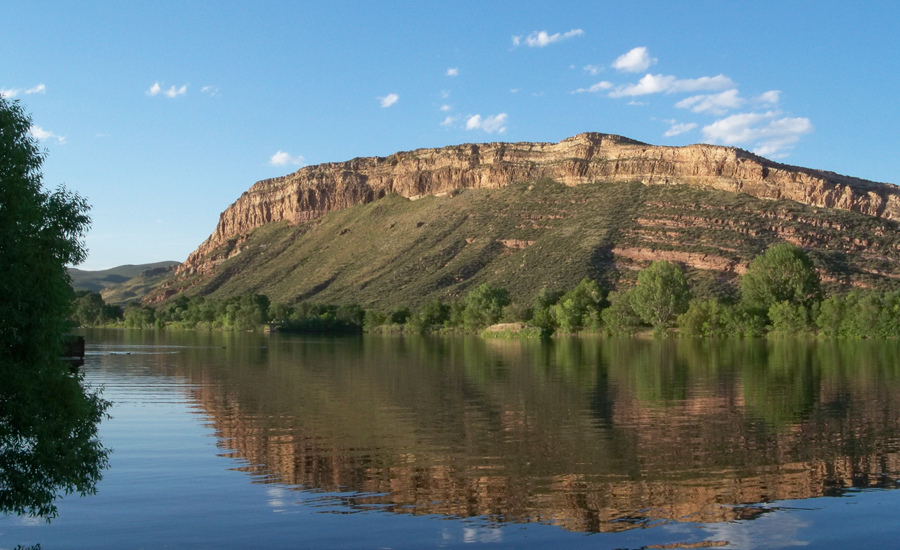
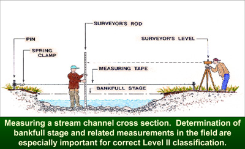
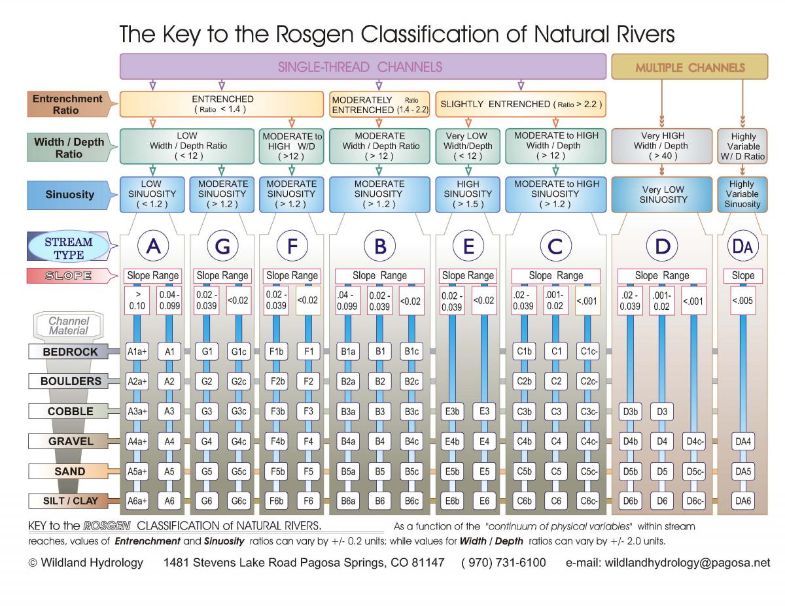

{width=100%}

## Summary

In this assignment you will put the pieces together from previous labs. You will perform a reach-scale assessment of: wadable stream habitat, biotic index, Rosgen classification, channel geometry (i.e., channel cross-section), relative bed stability and flow (Q). Next, you will use StreamStats and any other maps (e.g., Google maps) to evaluate how upstream land use might influence the study reach. Keep in mind that upstream agriculture, wildfire, reservoir/dam systems, urban areas, etc. can all affect the study reach. For example, dams will hold back both water and sediment. For this reason many reaches downstream of dams have altered geomorphology and sediment regimes. Recall that bankfull discharge is the channel forming flow. This means that at bankfull flows sediment will get moved around. As this happens, channel and point bars are formed, fine sediment is moved around, and fines are removed from large spaces between cobbles. This sediment movement creates habitat for macro-invertebrates and fish spawning. However, we rarely get bankfull flows in the Poudre River in and around Fort Collins.

See [here](https://www.fcgov.com/poudrereportcard/pdf/sopr2016.pdf) and [here](https://www.fcgov.com/naturalareas/pdf/erm_executive_summary.pdf?1421441554) for background information on how the Poudre River hydrology, habitat, river-floodplain connectivity, and sediment transport have changed over the past 150 years. 

## Site

We will be working on a reach at the [Watson Lake State Wildlife Area](https://poudreheritage.org/locations/watson-lake-state-wildlife-area/)

Here is the [Google map location](https://goo.gl/maps/yWJXf5rMgv5iG8Hk9)

With your group find a location to perform the field work. In the field you will collect the data necessary to do the following:
1. Assess the wadable stream habitat
2. Calculate the biotic index
3. Classify the stream according to Rosgen
4. Calculate the Relative Bed Stability (RBS)
5. Calculate stream flow using the velocity-area method

## Field work

You will perform the field work to accomplish each of the tasks (1-5) listed above. In addition to doing each of these, you should walk around the site and observe the management and land-use. There is a diversion structure that diverts water into Watson Lake. Note there is a fish ladder on the diversion. There is also a fish hatchery downstream of the lake and a dairy farm upstream of it. Sometimes the smell from the dairy farm can make it hard to miss....

This is the reach-scale assessment. I will provide print-outs from the previous field labs (stream health, fluvial geomorphology, and velocity-area) to help guide you through this work. But hopefully a lot of it will be self-directed as you are becoming expert watershed scientists and may be tasked with these measurements and analyses in your jobs in the next year or two. 

During your geomorphic cross-section measurements remember to extend out onto the floodplain and take notes of key locations like left and right bankfull and left and right wetted edges. 

Remember to take ample notes and photographs!

## Results

### Reach scale results (40 points)

What is the biotic index of your stream reach? (5 pts)

What is the wadable habitat assessment of your stream reach? (5 pts)

Provide a geomorphic cross-section of your reach. Identify the floodplains, left and right bankfull, and left and right wetted edge. (5 pts)

{width=100%}

 

What is the Rosgen classification? Justify this by providing the Rosgen entrenchment ratio (<1.4, 1.4-2.2, or >2.2), the bankfull width to bankfull depth ratio, the sinuousity, the slope, and the dominant channel material. (10 pts)

{width=100%}

What is the D50, DCBF and RBS? (5 pts)

What is your measured stream discharge? (5 pts)

Did your measurement conform to USGS standards? If so, explain. If not, explain. (5 pts)

### Watershed scale results (15 points)

Go to [StreamStats](https://streamstats.usgs.gov/ss/) and delineate the watershed contributing to your reach (an approximate reach location is sufficient). Select "all basin characteristics" and summarize this information in a table. (15 pts)

## Synthesis (35 pts)

Compare your measured discharge to the discharge at the same time at the nearest [USGS gauge](https://nwis.waterdata.usgs.gov/nwis/uv?site_no=06752260). Is your Q the same, more, or less than the Q at the USGS gauge? If it is diffenert provide a plausible explanation for why. (10 pts)

Using the biotic index, wadable habitat assessment and RBS give an assessment of the overall condition of the stream. (10 pts)

Building upon the previous question use your watershed-scale data, your walk around the site to view the local land use, and your expertise as a watershed scientist to explain what local and upstream land cover/land use, water management, etc. may be impacting this reach and resulting in the current condition (good or bad). (15 pts)

