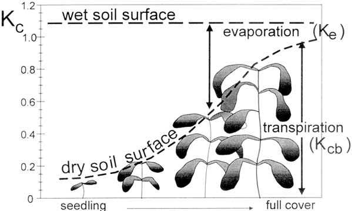
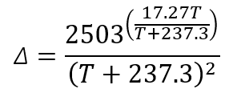
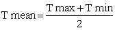
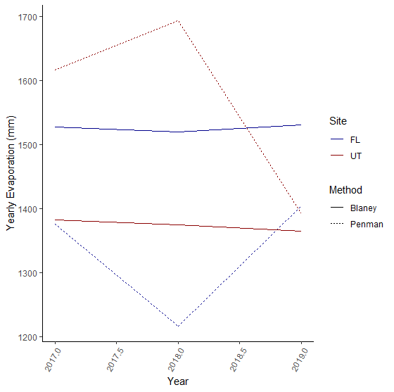
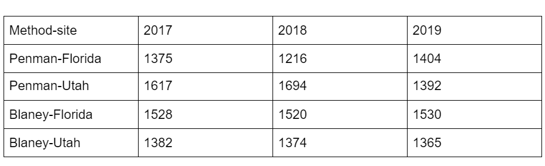

# Summary

The term evapotranspiration ET is commonly used for two water loss processes from land surface to atmosphere (Evaporation and Transpiration).  Evaporation is the process where water liquid is converted to water vapor from sources such as soil surface, wet vegetation, pavement, lakes, oceans, etc. Transpiration consists of the vaporization of liquid water within the plant and subsequent loss of water through leaf stomata. Evaporation and transpiration occur simultaneously, and both are affected by solar radiation, air temperature, vapor pressure deficit, and wind speed. In this study, we are focusing on estimating evapotranspiration using two widely used ET modeling approaches, Blaney-Criddle and Penman-Monteith, and discuss their strengths and weaknesses by applying them in two climatically different regions. The appropriateness of the applied models and associated equations will be discussed in detail for each climatic region.

## Overall Learning Objectives:

At the end of this module, students will be able to explain the key variables for estimating ET and what environmental factors directly affect it. Additionally, students will estimate ET using Penman-Monteith and Blaney-Criddle methods, identify how these ET methods differ, and discern which method should be considered based on a climatic region. 

## Required Readings and Videos:

### Reading:
#### [Evaporation and the water cycle:](https://www.usgs.gov/special-topic/water-science-school/science/evaporation-and-water-cycle?qt-science_center_objects=0#qt-science_center_objects){target="_blank"}

#### [Crop Water Needs (FAO56)](http://www.fao.org/3/s2022e/s2022e07.htm#:~:text=The%20Blaney%2DCriddle%20method%20always,temperature%20is%2028%C2%B0C.){target="_blank"}

#### [Step by Step Calculation of Penman-Monteith Evapotranspiration (FAO-56 Method) ](https://edis.ifas.ufl.edu/ae459){target="_blank"}

#### Evaporation and Evapotransporation Video:

<iframe width="560" height="315" src="https://www.youtube.com/embed/4765Sg2mKco" frameborder="0" allow="accelerometer; autoplay; encrypted-media; gyroscope; picture-in-picture" allowfullscreen data-external="1"></iframe>

# 1. Evapotranspiration (ET) Introduction

### a. What is ET and why does measuring ET matter? 

Evapotranspiration (ET) is used to describe the processes of evaporation, where liquid water is converted to water vapor and removed from the land surface, and transpiration, where liquid water within a plant is vaporized and lost through leaf stomata. This vaporization is simultaneous and is dependent upon solar radiation, temperature, humidity, and wind speed. Crop characteristics, cultivation practices, and environmental aspects all contribute to ET, such as when plant crops are small, water is lost through evaporation. In contrast, when plants are mature, water is primarily lost through transpiration. Different crops will have different transpiration rates and thus affect overall ET rates. ET measurements help estimate crop irrigation demands under changing conditions. Overall, evaporation and evapotranspiration account for 15% of the water vapor in the atmosphere and are the principal ways water moves from land surfaces and oceans into atmospheric water vapor. 

### b. Factors directly affecting ET:

Aside from weather factors, crop type and development need to be considered when gauging ET in agricultural settings. In similar environmental settings, crop height, roughness, reflection, root characteristics, and ground cover affect ET rates. Other management and environmental factors affecting ET include soil salinity, fertility, permeability, pest presence and control, ground cover, plant density, and volumetric water content. Cultivation and irrigation methods can alter the microclimate of crops, such as no-till practices, mulching, as well as adding windbreaks.

#### Evapotranspiration in agricultural settings:

<iframe width="560" height="315" src="https://www.youtube.com/embed/EuW9Sd3i_mY" title="YouTube video player" frameborder="0" allow="accelerometer; autoplay; clipboard-write; encrypted-media; gyroscope; picture-in-picture" allowfullscreen data-external="1"></iframe>

###  c. Energy and ET 

We can measure evapotranspiration by determining the amounts of energy available through radiant energy or sensible heat. In applying laws of energy conservation, an energy balance equation can be derived:
Rn = G + l ET + H + A, where 
Rn is the net radiation, 
H is sensible heat, which is heat transferred between the land surface and the air,
G is soil heat flux, which is heat transferred between the ground and air
l ET is latent heat flux, or λE, or energy required for the change of phase from liquid water to vapor and A is advection, or energy transferred by wind. This is often ignored which implies all energy is vertically transferred between the land and atmosphere (ignoring windy conditions).
With the exception of advection, all of these factors can be negative. Heat stored in plants is often negligible comparatively and not used. 

In addition to readily available energy, water and a vapor pressure deficit are necessary for ET to occur. 
Reference evapotranspiration, or ETO, is evapotranspiration from a hypothetical grass reference crop with particular characteristics that are not short of water. This is used to examine evaporation independent of crop type, development (such as the stage of growth), and management, and it assumes abundant water with no soil factors affecting ET. As climatic parameters are the only factors affecting ETO, it can be evaluated using weather data. 

ETC is crop evapotranspiration for a specific crop cover under standard conditions, assuming a healthy crop with adequate fertilizer, abundant soil water, grown in large fields, and able to reach full production. ETC is different for each crop due to anatomy of plants and their aerodynamic properties, regardless of climatic conditions. Crop coefficients, KC, are determined as ratios of ETC/ETO. KC changes throughout a growing season. 

[Figure 1](https://www.google.com/url?q=http://www.fao.org/3/X0490E/x0490e0a.htm%23factors%2520determining%2520the%2520crop%2520coefficient&sa=D&ust=1607216950112000&usg=AOvVaw2V3a8_1H5CgviYD_Ynxo5r){target="_blank"}: The effect of evaporation on Kc. The horizontal line represents Kc when the soil surface is kept continuously wet. The curved line corresponds to Kc when the soil surface is kept dry but the crop receives sufficient water to sustain full transpiration. Figure and caption courtesy of Food and Agricultural Organization of the United Nations (FAO).
 

[Figure 2](https://www.google.com/url?q=http://www.fao.org/3/X0490E/x0490e0a.htm%23factors%2520determining%2520the%2520crop%2520coefficient&sa=D&ust=1607216950111000&usg=AOvVaw0ZRVB7U4_ujZgqA301MZBF){target="_blank"}: Extreme ranges expected in Kc for full grown crops as climate and weather change. Figure and caption courtesy of FAO. 

###  d. Evaporation and ET measurements

Evaporation is commonly measured using a Class A evaporation pan, which is used to measure how much water directly evaporates daily. Evapotranspiration is also measured using an atmometer, which uses different covers on the top of the device to approximate different reference crops. More information can be found in the [Meteorological Measurements module](met_lab/met_lab.html). 

How to use a Class A evaporation pan. Note that the measurement in the pan is being taken with dial calipers rather than reading the hook gauge itself. 

<iframe width="560" height="315" src="https://www.youtube.com/embed/kSMA94T4SJc" frameborder="0" allow="accelerometer; autoplay; encrypted-media; gyroscope; picture-in-picture" allowfullscreen data-external="1"></iframe>

# 2. Modeling ET

###  a. Penman-Monteith

The Penman approach is an energy balance and mass transfer method to estimate evaporation from open water, bare soil, and grass using climatological data as input:

{width=50%}

where, λE= evaporative latent heat flux (MJ m-2 d-1), Δ= slope of the saturated vapor pressure curve, Rn = net radiation flux (MJ m-2 d-1), G = sensible heat flux into the soil (MJ m-2d-1), γ = psychrometric constant (kPa °C-1), and Ea = vapor transport of flux (mm d-1) (2)

Including a bulk surface resistance term, Montieth further modified Penman (using daily values):

{width=50%}

where ρa = air density (kg m-3), Cp = specific heat of dry air, eso = mean saturated vapor pressure (kPa) computed as the mean eo at the daily minimum and maximum air temperature (°C), rav = bulk surface aerodynamic resistance for water vapor (s m-1), ea = mean daily ambient vapor pressure (kPa), and rs = the canopy surface resistance (s m-1).
There are further derivations of Penman-Montieth, but for this assessment part of this module, we will use the Penman-Montieth equation for potential evaporation for open water conditions, following Shuttleworth (1993):

{width=50%}

where, PE = potential evaporation in mm d-1, Rn = net radiation in mm d-1 ,T = mean air temperature at 2 m height in °C, Δ = slope of the saturation vapor pressure-temperature curve (kPa C-1), γ = psychrometric constant (kPa C-1), u = mean daily wind speed in m s-1, e* = saturation vapor pressure in kPa. ea = mean actual vapor pressure at 2 m height in kPa.

λ = latent heat of vaporization.
For the assessment part of this module, use the following:

Δ = slope of the saturation vapor pressure-temperature curve (kPa C-1). 

{width=50%, height=10%}

(use Tmean for this equation)
γ = psychrometric constant (kPa C-1).  (This is dependent upon atmospheric pressure and elevation, but for this module we will use 0.055 kPa C-1) 

e* = saturation vapor pressure in kPa.

Use the average of e* at Tmin and e* at Tmax for each day, as calculated using this equation:

{width=50%}
 
where e*(T) is the saturation vapor pressure for either Tmax or Tmin.  T values are in degrees C, and es is in kPa.

λ = latent heat of vaporization. (Use 2.5 MJ kg-1)

### b. Blaney-Criddle

Blaney-Criddle is much more simplistic compared to Penman-Monteith. It is more commonly used when meteorological data is unavailable and calculates evapotranspiration for a reference crop. The method always uses mean monthly values for both temperature and reference evapotranspiration. As the FAO notes, Blaney-Criddle is not very accurate and only provides a rough estimate. Under extreme conditions, the method is inaccurate. During windy and dry events in sunny areas, ETO is underestimated, and in humid, calm events in cloudy areas, ETO is overestimated.  

ETo = p ·(0.46·Tmean + 8) 

where, ETO = Reference crop evapotranspiration (in mm/day) as an average for a one month period, 

T mean = mean daily temperature (°C)

p = mean daily percentage of annual daytime hours

8 = value for a reference crop, which is calculated as growing grass of 8-15 cm

If available, the mean daily temperature is calculated as:

{width=50%}

{width=50%}

{width=50%, height=30%}

The mean daily percentage of annual daytime hours, p, is calculated based on the latitude of the site. 

#### Table 1: Mean daily percentage (p) of annual daytime hours for different latitudes. Table and caption courtesy FAO.

###  c. Equation differences

Numerous variables are necessary to calculate Penman-Montieth, but for the sake of this module, we will simplify to an open water simulation (assuming water is readily available) and thus we will estiamte potential evaporation. Potential evaporation is the upward bound of evapotranspiration as water is unlimited and is able to move freely into the air above the land surface. Rather than Penman-Montieth, we are using the derivation by Shuttleworth that standardizes measurement heights at two meters for wind speed, temperature, and humidity. In comparison to Penman-Montieth, Shuttleworth excludes ground heat flux, G, assuming that when taken at daily time steps, G is negligible. The Shuttleworth equation also does not factor in aerodynamic resistance, ra, as surface roughness is not a variable commonly measured at weather stations. Similarly, surface resistance, rs, is difficult to, and often not, measured as it describes how water moves through roots, xylem, leaves and soil on a daily basis.

For the basis of this module, students will compare the upper limit of evaporation using the Shuttleworth equation vs. the temperature based Blaney-Criddle approach. 

###  d. Data Source

[SCAN Network](https://www.nrcs.usda.gov/Internet/FSE_DOCUMENTS/nrcseprd775006.pdf){target="_blank"}

### Overview of the SCAN Network:
- Used to monitor soil health
- Primarily in an agriculture setting
- Drought Monitoring
- Predicting regional shifts in irrigation water requirements
 
 

#### Table 2. Standard SCAN site configuration. 

###  e. How we chose our sites

Two sites were chosen that had the necessary data available in order to conduct both analysis. The two sites represent different climates where water is a stressed resource in a dry climate (Utah) or plentiful in a humid climate (Florida).We wanted to be able to analyze the limits of both of the equations in different climates where water has different availability.

###  f. Demonstrate how to calculate the variables and modeling in R.

<iframe width="560" height="315" src="https://www.youtube.com/embed/JQ-0cVKFcZo" frameborder="0" allow="accelerometer; autoplay; encrypted-media; gyroscope; picture-in-picture" allowfullscreen data-external="1"></iframe>

# 3. Synthesis and answer key (50 points)

**1.   In your own words how do the Penman-Montieth and Blaney-Criddle equations differ? What variables does each consider and what component is used as the energy source for each? (5 points)**
  
a. The Penman-Montieth equation uses more variable to calculate the potential evaporation (PE), wind, net radiation, air temperature and the vapor pressure deficit are used to calculate PE. For Blaney-Criddle criddle only a crop reference, air temperature and a multiplier based on longitude and latitude are used to calculate the ET. Net radiation is used as the energy source with soil flux if it is available and the amount the multiplier based on latitude and longitude varies with time of year and is used as the amount of time that sunlight can drive ET as the energy source.

**2. Provide a graph comparing the results of the Penman-Montieth estimations for Potential Evaporation in (mm/day) Florida SCAN site (2009) and Utah SCAN site (2167) for the 2017-2019 calendar years. (10 points)**

Figure 1. Potential Evaporation (mm/day) plotted against the date of observation and colored by site; Florida (blue) and Utah (red). Potential Evaporation was modeled using the Penman-Montieth equation.

a. What site has more Potential evaporation (mm/day)? And why?

    i. The Utah site has more potential evaporation occur on a yearly basis the amount of radiation in Utah combined with higher temperature and a higher vapor pressure deficit due to low relative humidity lead to more evaporation.
  
b. Why is there a fluctuation in potential evaporation on a day by day basis?What time of the year does Potential evaporation peak?

    i. Because the Penman-Montieth equation uses a lot of variable net radiation, wind speed, air temperature, and vapor pressure deficit which shift on a daily basis based on local weather conditions the estimation of Potential evaporation shift naturally, However a general trend based on the time of the year is observable with the highest peak occurring during the summers at both sites.
      
**3. Provide a graph comparing the results of the Blaney-Criddle estimations for Potential Evaporation in (mm/day) Florida SCAN site (2009) and Utah SCAN site (2167) for the 2017-2019 calendar years. (10 points)**

Figure 2. Potential Evaporation (mm/day) plotted against the date of observation and colored by site; Florida (blue) and Utah (red). Evapotranspiration was modeled using Blaney-Criddle equation.

a. Blaney-Criddle estimates evapotranspiration on a monthly basis, do you think this is accurate?

    i. Blaney-Criddle estimates the monthly evaporation rate which will reduce the amount of accuracy because on any given day the actual evaporation rate could be higher or lower. 
  
b. Who could benefit from using the Blaney-Criddle method the estimate ET?

    i. Farmers could benefit from learning how to use the Blaney-Criddle method to estimate the amount of ET in a month to think about how much water they should put on a field on any given month.
  
**4. Provide a graph comparing the yearly sum of evaporation of the Penman-Montieth and  Blaney-Criddle estimations in (mm) for the Florida (2009) and Utah (2167) SCAN site for the 2017-2019 calendar years. (15 points)**

Figure 3. Yearly estimation of evaporation (mm) plotted against the date of observation and colored by site and linetype by method; Florida (blue) and Utah (red), Penman-Montieth (dotted) and Blaney-Criddle (solid).
    
a. Fill in the table of yearly sums of Evapotranspiration (round to the nearest mm)

Table 1. Yearly sums of evaporation of the Florida and Utah sites for the 2017-2019 calendar years calculated using Penman-Montieth and Blaney-Criddle equations.

b. Using the graphs and tables explain the results of your evaporation estimations? 

    i. In Figure 1 and 2 we see that in both different scenarios Utah peaks at a higher evaporation rate than the Florida site. In Figure 3 and Table 1 we see that the cumulative sum using the Blaney-Criddle equation does not tend to fluctuate whereas the Penman-Montieth equation results in more fluctuation year to year. Weather patterns will affect the amount of evaporation calculated from the Penman-Montieth equations because it relies on more variables whereas the Blaney-Criddle equation only relies on air temperatures and has a consistent factor for net energy based on time of year which will reduce the fluctuations of evaporation. 

c. Are results overestimated, underestimated, or both? What leads to these estimations? 

    i. In a dry region the Penman-Montieth equation will overestimate the ET and in a humid environment it will underestimate the ET. Weather patterns will affect the amount of evaporation calculated from the Penman-Montieth equations because it relies on more variables whereas the Blaney-Criddle equation only relies on air temperatures and has a consistent factor for net energy based on time of year which will reduce the fluctuations of evaporation. 

**5. If you were a farmer which method would you choose if you had to monitor evaporation rates? (10 points)**

  a. If I were a farmer I would use the Blaney-Criddle equation to figure out when and how much water I have delivered to my farm for the farming season. However I would use the Penman-Montieth equation to plan how much water I should put on a field on any given day to get the most out of my water allotment. 
