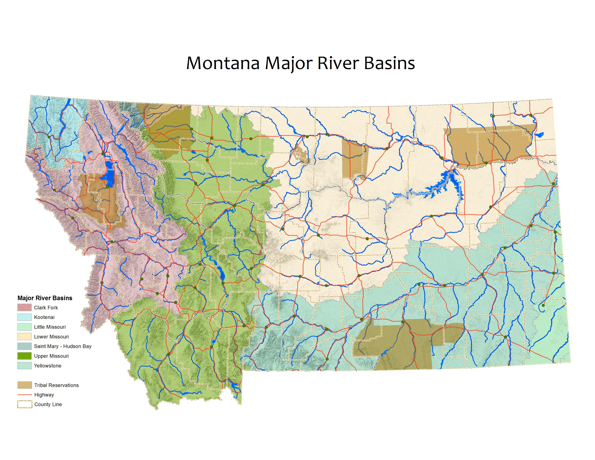

https://tpcovino.github.io/Git_home/watershed_analysis/index.html

## Regenerating token

[Overview and schedule for ENSC 445/545 Watershed Analysis](ENSC_445_Syllabus.html){target="_blank"}

[1 - Intro to plotting and data visualization in R](1-Intro-plotting-R-master/01-Plotting_Demo_BLANK.Rmd){target="_blank"}

[Lab and online module for Estimating Evapotranspiration using Blaney-Criddle and Penman-Monteith methods](et/ET_PM_vs_BC.html){target="_blank"}

{width=50%}

{width=50%}

